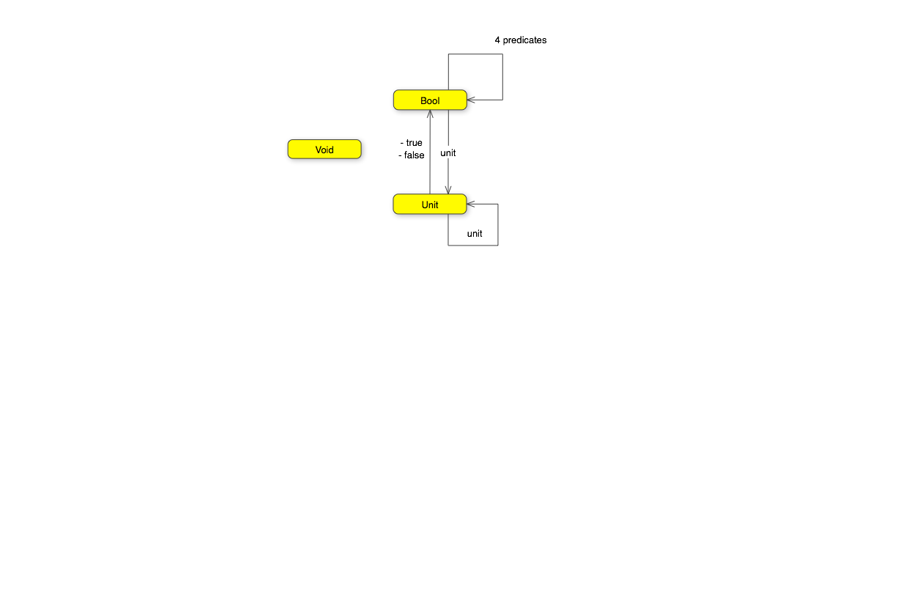

# 2. Types

- Type is a set of values, finite or not
- Category of `Set`, morphisms are functions
- Hask is the same except for _|_ bottom means non termination. undefined in haskell.
- Denotaional semantics, encode programming so you can solve use maths equations
- CT Monads for computational side effects
- Void is the empty set, absurd, can't be called. Falsity in logic 
- Unit is the single value

## Challenges

- Memorise in F#

```
let memoize f =
    let mutable cache = Map.empty
    fun x ->
        match cache.TryFind x with
        | Some res -> res
        | None ->
             let res = f x
             cache = cache.Add(x,res)
             res
```

- Try to memoize a function from your standard library that you normally use to produce random numbers. Does it work?

No.

- Random number with seed. 

Yes

- “Which of these C++ functions are pure?”

Factorial: yes. getchar: no. f: no, side effect. f with static: no, hidden mutable.

- How many functions from Bool to Bool

```
let alwaysTrue  _   =  true
let alwaysFalse _   = false
let isTrue (x:bool) = x
let not             = function true -> false | false -> true
```

- Draw a picture of a category whose only objects are the types Void, () (unit), and Bool; with arrows corresponding to all possible functions between these types. Label the arrows with the names of the functions.


