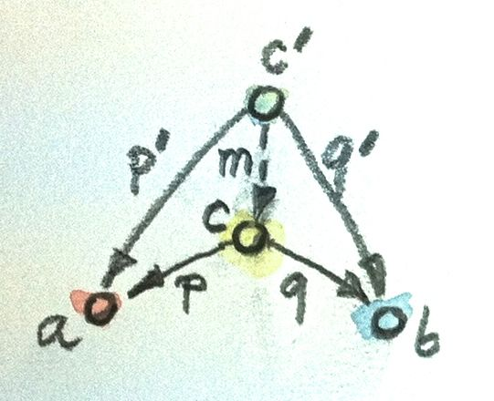
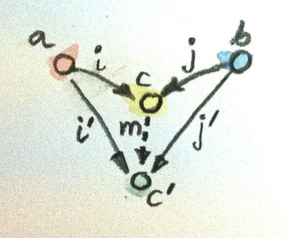

# Products and Coproducts

- In CT we can only see dots, so we can only infer things by patterns of relationships (e.g. cypher matching)
- Follow shape of arrows, link graph theory patterns
- Rank objects into hierarchy. Poset for partial ordered set. In Poset the morphism is the ordering relationship, e.g. `<=` for numbers, `subset of` for sets.

## Initial

- Initial object has zero or one and only one morphism to others
- e.g. Empty set, absurd, lowest in poset 
- Maybe be none or more than 1 but unique up to isomorphism

## Terminal

- Terminal object is the dual of initial. Largest in poset.
- is unit. One and only one function to it, singleton in sets (vs Bool which has two functions of true and false)

## Duality

- reverse, with Terminal and Initial reversed in co-category. 
- Composition must also be reworked so it is still valid.

## Equality & Isomorphic

- Lots in maths, e.g. propositinal / intensional / extension equality etc.
- Isomorphic: two morphisms in opposite directions. Both cancel to id (i.e. inveritble morphism). So `f.g=id and g.f=id`
- Isomorphic is about the same shape, can't tell one from another
- Initial unique up to uniqye isomorphism. If two are both initial, they both have a unique link to each other, which compose to id, so they are isomorphic. Two things can have more than 1 isomorphism, but in this situation the morphisms are unique (because the objects are inital), so its a unqiue morphism.
- All universal constructions have the proerty: _uniqueness up to unqiue isomorphism_

## Product

- Two functions, projections, `fst` and `snd`.
- The pattern / shape, is a triangle. C at the top, which has two morphisms (p,q) that get to a and b.
- Examples of building:

```
// Can Int be a product type giving Int and Bool ? Yep

p :: Int -> Int
p x = x
q :: Int -> Bool
q _ = true

// How about (Int,Int,Bool) ?  Yep 

p :: (Int, Int, Bool) -> Int
p (x, _, _) = x
q :: (Int, Int, Bool) -> Bool
q (_, _, b) = b”
```

- Other part of definition is ranking of possibilities. Which c or c' is better out of two of them ?
- We want it to be better / more universal. C is better if morphism from 'c to c, but also it's projections better / more universal, i.e. we can can recreate p' and q' using an m.



- Here m is factorising p' and q'.
- For Int we can have `m x = (x,True)`, for the triple tuple, we can use `m (x,_,b) = (x,b)`
- Product, can get stuff back in most efficient way. Factorises other ones if it can get from them, but not back.
- In Set, is the cartesian product of two sets
- _A product of two objects a and b is the object c equipped with two projections such that for any other object c’ equipped with two projections there is a unique morphism m from c’ to c that factorizes those projections_
- Factorizer function that works outs m between two candidates:
```
factorizer :: (c -> a) -> (c -> b) -> (c -> (a, b))
factorizer p q = \x -> (p x, q x)
```

## Coproduct

- coproduct is the opposite, two injections `i :: a -> c and j :: b -> c`
- Ranking revered: object c is better than object c’ that is equipped with the injections i’ and j’ if there is a morphism m from c to c’ that factorizes the injections:
```
i' = m . i
j' = m . j
```


- In Set, it is the disjoint union. So for two sets, its pairs of the first with index 0, and the pairs of the second with a different index 1. So making unique pairs of all of them. You can think of an element of a disjoint union as being tagged with an identifier that specifies its origin.
- Factoriser for CoProduct: Given a candidate type c and two candidate injections i and j, the factorizer for Either produces the factoring function:

```haskell
Factorizer :: (a -> c) -> (b -> c) -> Either a b -> c
factorizer i j (Left a)  = i a
factorizer i j (Right b) = j b
```

## Product and Coproduct examples

- In integer maths, product is *, coproduct is +
- In sets, product is carteisan product, coproduct is disjoint union
- In poset with morphism being `<=`, product is min, coproduct is max
- In logic, product is AND, coproduct is OR


## Asymmetry

- Product acts like multiplcation, with terminal object being 1
- CoProduct acts like addition, with initial object being 0
- Functions, the morphisms of Set, are asymetric, due to mapping between Domain and Codomain
- Domain can be smaller than Codomain, so it gets embeded, or Codomain is smaller, in which case things are collapsed.
- Bijection is 1-1, i.e. in S, isomorphism is bijection.

## Challenges

1 - Terminal unique to isomorphism

Like the identity, i and j must have unique morphisms coming to them from each other, hence g.f = id. As id is a unique morphism, they are unique up to isomorphism.

2 - Product of two poset objects

In a poset, morphism means <=.
So c, the product of a and b, must be `c <= `a AND `c <= b`.  To be the best, it must not be factorisable, so in this case it will be the highest value that meets this requirement, in this case it will be `min(a,b)`.

3 - CoProduct of two poset objects

The reverse of 2, so c >= a and c >= b, and to be the best candidate must not be factorisable, so best is `max(a,b)`.

4 - Either in F#

```fsharp
type Either<'a,'b> = Left of 'a | Right of 'b
```

5 - Show either is better. We factorise with m.

```fsharp
let i (n:int) = n

let j = function
    | true -> 0
    | false -> 1

let m = function
    | Left x -> x
    | Right true  -> 0
    | Right false -> 1

// Confirm i = Left >> m
let i' = Left >> m
let j' = Right >> m
```

6 - Why is i and j no better than Either ?

```fsharp
let i = id

let j = function
    | true  -> 0
    | false -> 1
```

Proof by contradiction.  Assme an m exists that factorises Either.
So:
- `Left(x) = m . i(x) ` and `Right(y) = m . j(y)`.
- Choose `x = 0`.  So `i(0) = 0, =>  Left(0) = m(0)`.
- Choose `y = true`. So `j(true) = 0, => Right(true) = m(0)`
- This means m(0) can be either Left(0) or Right(true) which is not a function, hence m cannot exist.

7 - Are these better than Either ?

They are isomorphic, can be freely converted back and forth

```fsharp
let m = function
    | 0 -> Right true
    | 1 -> Right false
    | x when x < 0 -> Left x
    | x -> Left <| x - 2
```

8 - Inferior example

We can use the following injections

```fsharp
let i = function
    | x when x < 0 -> x
    | x            -> x + 3

let j = function
    | true  -> 0
    | false -> 1
```
We can use similar m as in answer 7, but because we have a 'gap' around value '2', we can write an infinite number of them were 2 gets mapped to lots of different values. As there is no unique m, it must be inferior.