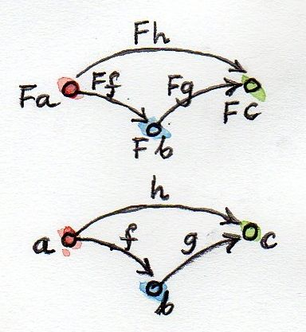
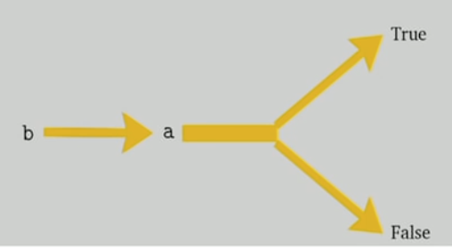
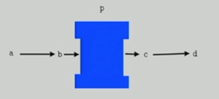

# Functors

- A mapping between categories. Mapping of both objects, morphisms including id and composition. __Preserves__ connections and hence structure.
- It can collapse, but not expand/tear
- Like functions it can collapse and embed
- It the source is a singleton category, the functor just selects it
- Max collapsing functor is called the constant functor Δc. It maps all objects to one object, and all morphisms become id on that object. Like a black hole.



## Functors in programming

- In our category of types and functions, functors map this category to itself, hence they are _endofunctors_
- Maybe maps a to Maybe a. Maybe is not a type, it's a type constructor (because once it has a type, it makes a new type), vs. a data constructor like Some or None
- For maybe, we need to define morphisms as well. So `:a -> b` becomes `Maybe a -> Maybe b`

```haskell
f’ :: Maybe a -> Maybe b
f’ Nothing = Nothing
f’ (Just x) = Just (f x)
```

- `fmap` lifts a an f into working on Maybe values

```haskell
fmap :: (a -> b) -> Maybe a -> Maybe b
fmap _ Nothing = Nothing
fmap f (Just x) = Just (f x)
```

- To prove that the type constructor Maybe + fmap make a functor, we need to prove fmap preserve identity and composition (the _functor laws_)
- Equational Reasoning: substitute from function definitions

```haskell
-- Proving `fmap id = id` for Maybe 

-- Do Nothing, from defintion
fmap id Nothing = Nothing 
-- Now use id rule in reverse
fmap id Nothing = id Nothing    -- Done

-- Now Just
fmap id (Just x) = Just(id x)
-- replacing id x with x on the right
fmap id (Just x) = Just x
-- adding id back in
fmap id (Just x) = id (Just x)   -- Done
```

Now doing the same for composition

```haskell
-- Need to show `fmap (g. f) = fmap g . fmap f

-- Nothing
fmap ( g . f ) Nothing = Nothing
-- using defintion of fmap
fmap ( g . f ) Nothing = fmap g Nothing
-- using defintion of fmap
fmap ( g . f ) Nothing = fmap g ( fmap f Nothing ) 

-- Just case

fmap ( g . f ) (Just x) = Just (( g . f) x)
-- definition of composition
fmap ( g . f ) (Just x) = Just (g (f x))
-- defintion of fmap
fmap ( g . f ) (Just x) = fmap (Just (f x))
-- defintion of fmap
fmap ( g . f ) (Just x) = fmap g (fmap f (Just x))
-- composition
fmap ( g . f ) (Just x) = (fmap g . fmap f) (Just x)
```

Typeclasses work with Types and Type Constructors, so can define functor.  Lower case for generic types.

```haskell
class Functor f where
  fmap :: (a -> b) -> f a -> f b

  -- e.g. for Maybe
instance Functor Maybe where
  fmap _ Nothing = Nothing
  fmap f (Just x) = Just (f x)
```

### List functor

```haskell
data List a = Nil | Cons a (List a)

instance Functor List where
  fmap _ Nil =  Nil
  fmap f (Cons x xs) = Cons (f x) (fmap f xs) 
```

### Reader functor

(->) is a type constructor, makes a func from two types, and can be used in prefix like `(->) a` for a partially applied func constructor. With `r` meaning `(->) r`, so `r a` meaning `r -> a`. Can we write fmap so that

```haskell
fmap r a :: (a ->b) -> (r -> a) -> (r -> b)
fmap f g = f . g
-- in prefix form
fmap f g = (.) f g
-- point free
fmap = (.)
```

This is just function compostition, showing functions are functors

### Const functor

Functors may or may not allow views of what is in them (outside the defintiion of functors). Example is the Const type constructor, it ignores the last type completely.

```haskell
data Const c a = Const c

-- We ignore the f, coz it doesn't do anything
fmap :: (a->b) -> Const c a -> Const c b
fmap _ (Const c)  = Const c 
```

```fsharp
// Const functor in F#
type Const<'a,'b> = Const of 'a
```

`Const` is the Δc in endofunctors (black hole).

### Functor composition

Can use multiple composed fmaps to get through multiple layers of functor:

```haskell
square x = x * x
maybeInts = Just [1, 2, 3]   -- Maybe [Int]
-- PA the square Liust fmap, then fmap that over the Maybe
mis2 = fmap (fmap square) maybeInts
-- Also re-rewrite as
mis2 = (fmap . fmap) square maybeInts
```

```fsharp
let square x = x * x
let maybeInts = Some [1;2;3]
let mis2 = Option.map (List.map square) maybeInts
```

### Functors in CT

Functors are morphisms in the category of Cat, where objects are categories. It's a category of categories, but not all categories (i.e. not itself, like set paradox), so it is _small_.

### Challenges

1. Can we turn the Maybe type constructor into a functor by defining:

`fmap _ _ = Nothing`

No, functors preserve structure, what about Just ?  What about Id ?
      
which ignores both of its arguments? (Hint: Check the functor laws.)

2. Prove functor laws for the reader functor. Hint: it’s really simple.


3. Implement the reader functor in your second favorite language (the first being Haskell, of course).

```fsharp
// Reader in F#
let fmap f g = f << g
// Explicit types
type Arrow<'a,'b> = 'a -> 'b
let fmap2 (f: Arrow<'a,'b>) (g:Arrow<'c,'a>): Arrow<'c,'b> = 
  g >> f
```

4. Prove the functor laws for the list functor. Assume that the laws are true for the tail part of the list you’re applying it to (in other words, use induction).

```

Apply rules to fmap

```

---

## Bifunctor

- [George Wilson - The extended functor family](https://www.youtube.com/embed/JZPXzJ5tp9w)

```haskell
class Bifunctor p where
  bimap :: (a -> b) -> (x -> y) -> p a x  -> p b y

  first  :: (a -> b) -> p a x -> p b x
  second :: (x -> y) -> p a x -> p a y

-- For Either
instance Bifunctor Either where
  bimap :: (a -> b) -> (x -> y) -> Either a x -> Either b y
  bitmap f g (Left a)  -> Left  (f a)
  bitmap f g (Right x) -> Right (g x)
```

Laws:

- `bimap id id = id`
- todo: composition


## Co and Contra varient

- A normal functor is a Covariant functor

Polarity:

- Positive if a given type, or its return types
- Negative for parameters

Can a predicate of a, be a functor ? Nope.  We are sending and a in, getting a bool out.

Covarient functor: For f to be a functor, every a in f a must be a positive

So `new type Endo a = Endo ( a -> a )` is not covariant, because one a is negative position. It is _invariant_ in a.

Contravarient: Predicate is contra variant, because a only appears in negative position.

```haskell
class Contravarient f where
  contramap :: (b -> a) -> f a -> f b

newtype Predicate a = 
  Predicate { runPredicate :: a -> bool }

instance Contravariant Predicate where
  contramap :: (b -> a) -> Predicate a -> Predicate b
  contrmap f (Predicate p) = Predicate (p . f)
```

Think of normal functor as being full of a's, where as a contravariant functor is consuming a's.



Other example is a comparision (less than, greater than, equal).
There are contra-varient versions of `Applicative` (Divisible) and `Alternative` (Decidable), see contravariant package on hackage.

E.g. sorting in linear time.

## Profuctor

Covariant in it's right type parameter, but contravarient in its left type parameter

```haskell
class Profunctor p where
  dimap :: (a -> b) -> (c -> d) -> p b c -> p a d
  lmap  :: (a -> b) -> p b c -> p a c
  rmap  :: (c -> d) -> p b c -> p b d 
```
Profunctor contains Cs, wants Bs.



Class example is function arrow.  Given 3 funcs, compose them together:

```haskell
instance Profunctor (->) where
  dimap :: (a -> b) -> (c -> d) -> (b -> c) -> (a -> d)
  dimap ab cd bc = cd . bc . ab
```

Other example is Kleisli from Control.Arrow, and all other Arrows.
Profunctors are useful for `Lens`.