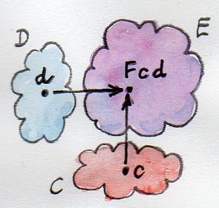

# Functoriality

- Functors are morphisms in Cat, so how we add them together, build them up ?
- __functorial__: acts on morphisms like an honest functor


## Bifunctors

- Maps objects: CxD -> E
- Also much map morphisms: `(f, g) ∘ (f', g') = (f ∘ f', g ∘ g')`
- Easier to think of functors on two arguments, check the laws for each argument seperately.



```haskell
class Bifunctor f where
    bimap :: (a -> c) -> (b -> d) -> f a b -> f c d
    bimap g h = first g . second h
    first :: (a -> c) -> f a b -> f c b
    first g = bimap g id
    second :: (b -> d) -> f a b -> f a d
    second = bimap id”
````


- Can either define bimap, or first + second


## Product and Coproduct bifunctors

- We can define bifunctors over both Product and Coproduct (sum types)
- If a product exists for a pair of objects, the mapping from those objects to the product is a bifubctorial.
- By duality, any coproduct must also be a bifunctor

```haskell
-- Tuple
instance Bifunctor (,) where
    bimap :: (a -> c) -> (b -> d) -> (a, b) -> (c, d)
    bimap f g (x, y) = (f x, g y)

-- Either
instance Bifunctor Either where
    bimap f _ (Left x)  = Left (f x)
    bimap _ g (Right y) = Right (g y)”
```

## Functorial ADTs

- Coz products and coproducts and functorial, we know the ADT structures built out of them are as well
- How about parametised?
- `Nothing` in Maybe, and `Nil` in List, and equivalent to `Const` functor (the one that ignores it's second argument).
- Then there is the `Identity` functor like `Just` which just encapsulate a type

```haskell
data Identity a = Identity a

instance Functor Identity where
    fmap f (Identity x) = Identity (f x)
```

```fsharp
type Identity<'a> = Identity of 'a

let fmap f (Identity x) = Identity (f x)
```

- Given these two simple functors of `Identity` and `Const`, we can build everything else up using products and sums.

```haskell

data Maybe a = Nothing | Just a”
-- Equivalent to
data Maybe a = Either (Const () a) (Identity a)
-- Maybe is the composition of the bifunctor Either with two functors, Const () and Identity
-- Const is actually a bifunctor but we partially apply it to make it to a functor
```

- We know functors compose, we need to show bifunctor with 2 functors works

```haskell
-- bf is a bifunctor, fu and gu are functors expecting a type variable, a and b are types
newtype BiComp bf fu gu a b = BiComp (bf (fu a) (gu b))
-- e.g. with Either bf, and functors of Const() and Identity:
BiComp Either (Const ()) Identity a b = BiComp (Either (Const () a) (Identity b) )
-- Is equivalent to Maybe b
```

- This is only a bifunctor iff bi is a bifunctor, and fu and gu are both functors, represented in Haskell by:

```haskell
instance (Bifunctor bf, Functor fu, Functor gu) =>
    Bifunctor (BiComp bf fu gu) where
        bimap f1 f2 (BiComp x) = BiComp ((bimap (fmap f1) (fmap f2)) x)

-- Automatically derive it

{-# LANGUAGE DeriveFunctor #-}
data Maybe a = Nothing | Just a
        deriving Functor
```

## Write functor

- Embelished functions like `type Writer a = (a, String)` i.e. Kleisli category, are also functorial in a. 
- How is Kleisli category related to a functor ?

```haskell
-- Kleisli composition aka the fish operator
(>=>) :: (a -> Writer b) -> (b -> Writer c) -> (a -> Writer c)
    m1 >=> m2 = \x ->
        let (y, s1) = m1 x
            (z, s2) = m2 y
    in (z, s1 ++ s2)

-- Identity
return :: a -> Writer a
return x = (x, "")

-- Can combinte to make fmap
fmap f = id >=> (\x -> return (f x))
-- which is:  Writer a -> Writer b
-- the id passes through writer a, the fish takes the b out, applies f, and wraps it up again
```

- Works for any Type which has a fish and return (I think this is basically saying Monads are also Functors)
- _Theorem for free_ means if fmap exists and preserves identity, it is unique.

## Covariant and Contravariant Functors

- If we flip the arguments of the Reader, can we make that functorial in a.

```haskell
type Op r a = a -> r

fmap :: (a -> b) -> (a -> r) -> (b -> r)
-- Not possible, cannot get the b and make it into an r
-- If could reverse the first f (b->a) it would be fine.
```

- The return is fixed, so we cannot make it a functor.
- If we go to the CoCategory Cop, same objects as C, but all arrows reversed.
- If we have a regular functor F, we can have a Contravarient Functor G, which maps objects the same, but reverses morphisms and applys a normal Functor (F in this case).
- Same as a functor, but from the opposite category, functor with a 'twist'


```haskell
-- Strictly a contravariant endofunctor
class Contravariant f where
    contramap :: (b -> a) -> (f a -> f b)

type Op r a = a -> r

instance Contravariant (Op r) where
    -- (b -> a) -> Op r a -> Op r b
    contramap f g = g . f
-- puts the f infront of the g
-- can reverse composition to get
contramap = flip (.)
```

## Profunctors

- Function arrow -> is contravariant in its first argument, covariant in the second, so if target category is Set, its called a profunctor.

```haskell
class Profunctor p where
    dimap :: (a -> b) -> (c -> d) -> p b c -> p a d
    dimap f g = lmap f . rmap g
    lmap :: (a -> b) -> p b c -> p a c
    lmap f = dimap f id
    rmap :: (b -> c) -> p a b -> p a c
    rmap = dimap id

instance Profunctor (->) where
    dimap ab cd bc = cd . bc . ab
    lmap = flip (.)
    rmap = (.)
```


## Challenges

1. Show that the data type:

data Pair a b = Pair a b
      
is a bifunctor. For additional credit implement all three methods of Bifunctor and use equational reasoning to show that these definitions are compatible with the default implementations whenever they can be applied.

2. Show the isomorphism between the standard definition of Maybe and this desugaring:

type Maybe' a = Either (Const () a) (Identity a)
      
Hint: Define two mappings between the two implementations. For additional credit, show that they are the inverse of each other using equational reasoning.

3. Let’s try another data structure. I call it a PreList because it’s a precursor to a List. It replaces recursion with a type parameter b.

data PreList a b = Nil | Cons a b
      
You could recover our earlier definition of a List by recursively applying PreList to itself (we’ll see how it’s done when we talk about fixed points).

Show that PreList is an instance of Bifunctor.

4. Show that the following data types define bifunctors in a and b:

data K2 c a b = K2 c
data Fst a b = Fst a
data Snd a b = Snd b
      
For additional credit, check your solutions agains Conor McBride’s paper Clowns to the Left: http://strictlypositive.org/CJ.pdf

5. Define a bifunctor in a language other than Haskell. Implement bimap for a generic pair in that language.

6. Should std::map be considered a bifunctor or a profunctor in the two template arguments Key and T? 
How would you redesign this data type to make it so?”
