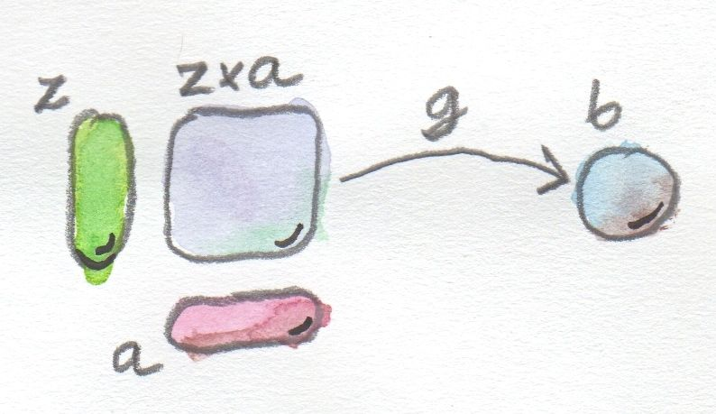
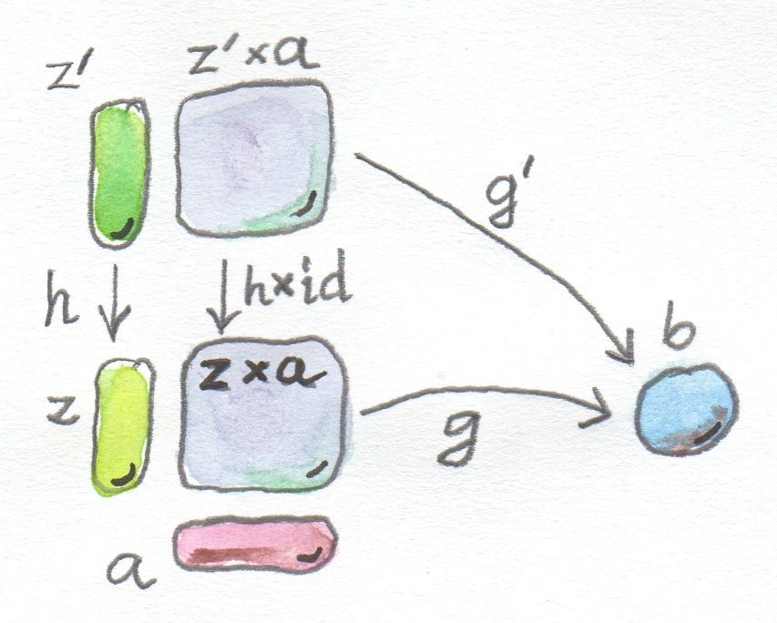
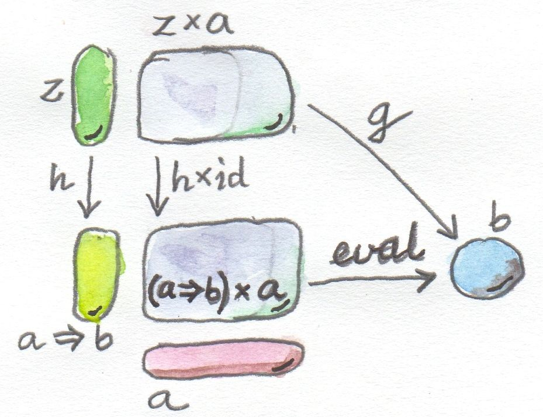

# Function types

Is a set of morphisms between the two types. A Hom-set.
In Set this is also an object, because sets are objects in Set :D
Most categories these are external hom-sets, in some categories you can make them internal.

## Universal construction of internal hom-set

Like product and coproduct we need a pattern of 3 objects, the function type, its argument and its result, called
function application or evaluation. z which applies a and gets b.

We get a product of z and a, with a connected to b by morphism.  This only works if there is a product in the given
category.



Usual factorisation / ranking:



We are mapping z'*a -> z*a. This is a endo-bi-functor. We don't need to worry about
a so use id for that part of the bifunctor.

This best object is called a=>b:



No guarantee this is exists, but it does in Set of any pair of a and b, and in Set
it is isomorphic to the hom-set Set(a,b).

Currying fits in here.

```haskell

g :: z * a -> b

-- curried
h :: z -> (a=>b)        

-- uncurry
g = eval . (h * id)


curry :: ((a, b)->c) -> (a->b->c)
curry f a b = f (a, b)

uncurry :: (a->b->c) -> ((a, b)->c)
uncurry f (a, b) = f a b

-- Curry is the factorizer for the universal construction of the function object
-- As a reminder, a factorisizer produces the factorizing function from a candidate)
factorizer :: ((a, b)->c) -> (a->(b->c))
factorizer g = \a -> (\b -> g (a, b))
```

## Exponentials

In maths the function object is the exponential.  Memosizing functions leads to:

a -> b, written as ba (b^a).
So for bool -> int is int^2.

## Cartesian closed categories

Types and functions in cccs, on which Set is a member, must have

- Terminal object
- Product of any pair of objects
- Exponential for any pair of objects.

Think of terminal as object ^ 0.
CCC are a model for the lambda calculus.

If a CCC also has the duals of Initial and CoProduct are follows, it is called a
bicartesian closed category

```haskell
a × (b + c) = a × b + a × c
(b + c) × a = b × a + c × a
```

## ADTs and exponentials

All the same rules follow as in algebra. `a^0 = 1` where 0 is the initial object, 1 is
the terminal object, and equality means isomorphism.

- Zero power: only one function `void -> a`
- Powers of one: single f of a -> ()
- First power: () -> a
- Exponentials of sums: F on two sums is pair of functions, on for each ase
- Exponetial of exponetials: curring
- Exponetials over products: a function returning pair is same a pair of functions making a single value

## Curry howard isomorphism

Every type can be considered a proposition. If the type in inhabited the prop is true,
false otherwise. Writing programs is equivalent to proving theorems.

```haskell
-- true in logic: ((a ⇒ b) ∧ a) ⇒ b
-- if a implies b, and a is true, then so is b

-- so we need eval :: ((a->b), a) -> b
-- which we can write

eval (f,x) = f x

-- false in logic: a ⋁ b ⇒ a
      
-- Want in haskkell: Either a b -> a
-- We can't write that !!

-- absurd in logic
absurd :: Void -> a

-- logic: false => a
-- anything follows from falsehood
````