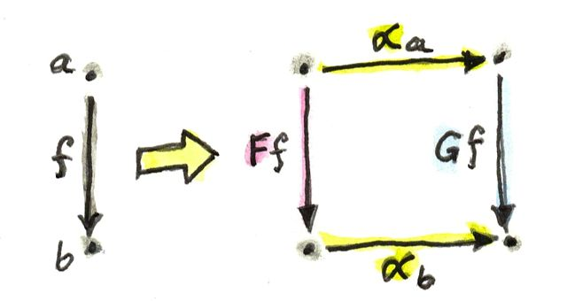
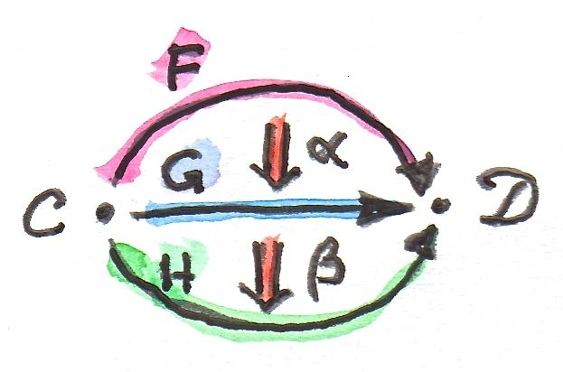
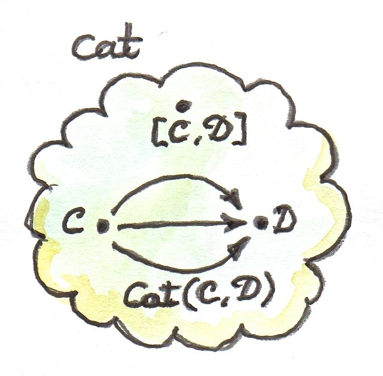

# Natural transformations

Functors can be thought of as embedding one category in another, the source categorying being a blue print.
Natural transformations and mappings between functors, comparing the embedding process, in the same category.
Called natural because are using morphisms (not adding new structure).

A natural transformation is a selction of morphisms, for every object a, it picks on morphism from Fa to Ga.
We call the natrual transformation α, then αa is the component of it on a:
`αa :: F a -> G a`


If there exists an a where we don't have a component, there can be no α.
Functors also map the morphisms so. Mapping is fixed so F f must map to G f, which greatly restricts possible α.

So if in C we have morphism `f between a -> b`, and we have two functors, so `F a -> F b`, and `G a -> G b`.  The natural transform means we have 2 new morphisms `F a -> G a` and `F b -> G b`


To confirm they are the same, we impost naturality condition that holds for any f:
`G f ∘ αa = αb ∘ F f`

The naturality condition is a pretty stringent requirement. For instance, if the morphism F f is invertible, naturality determines αb in terms of αa. It transports αa along f: `αb = (G f) ∘ αa ∘ (F f)^-1`

Viewing the 'end' of the last diagram, visually:


Existance of natural transforms between 2 functors is far from guarenteed, and tells
you a lot about the structure of a category.

You can say a α:

- Maps objects to morphisms
- Maps morphisms to commuting squares:



A **Natural isomorphism** is defined as a α whose compoents are all isomorphisms (invertible morphisms), making 2 functors isomorphic.

## Polymorphic functions

A α in programming means given a type a, an F a, an G a, we can map F a to G a, for all values of a, where F and G are functors. In CT: `G f ∘ αa = αb ∘ F f`

So a natural transformation is a repackaging from one container to another.
The naturality condition means doesn't matter wether we fmap, and then repackage, or
repackage and then fmap, it's the same, they are ortogonal: One moves the eggs, the 
other boils them.

```haskell
-- Polymorphic: works for any a
safeHead :: [a] -> Maybe a
safeHead [] = Nothing
safeHead (x:xs) = Just x

-- Verify naturality condition
fmap f . safeHead = safeHead . fmap f
-- usual equatorial reasoning ...
```

If one of the functors is the Const functor, then the natural transform is just
a function polymorphic in argument or return (depending on NT direction)

```haskell
-- length can be though of as a natural transform between list and const int functors
length :: [a] -> Const Int a
length [] = Const 0
length (x:xs) = Const (1 + unConst (length xs))
      
-- Here, unConst is used to peel off the Const constructor:
unConst :: Const c a -> c
unConst (Const x) = x


-- The other way is harder
scam :: Const Int a -> Maybe a
scam (Const x)      -> Nothing
```
The functor `Reader ()` takes any type a and maps it into a function type `()->a`.
This just chooses a single element from a, so there are a versions of it.

So a NT between reading() and maybe there are only two:

```haskell
alpha :: Reader () a -> Maybe a
      
-- There are only two of these, dumb and obvious:
dumb (Reader _) = Nothing      
obvious (Reader g) = Just (g ())   -- g applies to the unit value, all we can do
```

## Beyond naturality

- Any polymorphic function between two functors is a NT (including standard algebraic data types)
- Function types are contra-variant in arguments, so polymorphic function between two contravariant functors can be NT in the Cocategory of Haskell types, with a opposite notion of naturality.

## Functor category

- Objects are functors, morphisms are naturual transformations
- There exists an identity NT
- Morphisms must compose, so two NTs:


```haskell
αa :: F a -> G a
βa :: G a -> H a
      
-- These morphisms are composable and their composition is another morphism:

βa ∘ αa :: F a -> H a
      
- We will use this morphism as the component of the natural transformation β ⋅ α — the composition of two natural transformations β after α:

(β ⋅ α)a = βa ∘ αa

-- Looking at the digram, this is correct
H f ∘ (β ⋅ α)a = (β ⋅ α)b ∘ F f
```


- Category of functors between C and D is wrritne as `Fun(C,D)` or `[C,D]` or sometimes `DC`



- (small) categories are objects in Cat
- morphisms in Cat are Functors
- Cat(C,D) is set of functors between C and D
- A functor category [C, D] is also a set of functors between two categories (plus natural transformations as morphisms). Its objects are the same as the members of Cat(C, D).



## 2 categories

- Cats morphisms are functors, but functors (as a hom-set) aren't just a set, they have richer structure (they are a category themselves, with NTs as their morphisms).  
- This richer structure is called a 2-category, where the 1-morphisms also have 2-morphisms between them)

In Cat this is:
- Objects: (Small) categories
- 1-morphisms: Functors between categories
- 2-morphisms: Natural transformations between functors.

Instead of a Hom-set between two categories C and D, we have a Hom-category — the functor category DC. We have regular functor composition: a functor F from DC composes with a functor G from ED to give G ∘ F from EC. But we also have composition inside each Hom-category — vertical composition of natural transformations, or 2-morphisms, between functors.


### Composition in 2 categories

```
-- two functors in Cat can be composed
F :: C -> D
G :: D -> E
G ∘ F :: C -> E

-- two natural transforms on F and G
α :: F -> F'
β :: G -> G'
```


Notice that we cannot apply vertical composition to this pair, because the target of α is different from the source of β. In fact they are members of two different functor categories: D C and E D. We can, however, apply composition to the functors F’ and G’, because the target of F’ is the source of G’ — it’s the category D. What’s the relation between the functors G’∘ F’ and G ∘ F?

Having α and β at our disposal, can we define a natural transformation from G ∘ F to G’∘ F’? Let me sketch the construction.


### Challenges

1. None -> [],Some a -> [a].  Show we can map or transform first with equatiorial reasoning.
2. Reader () a -> [a], Reader () a -> [].  An infinite number.
3. Two, Some and None.  Some can be some true or sum false