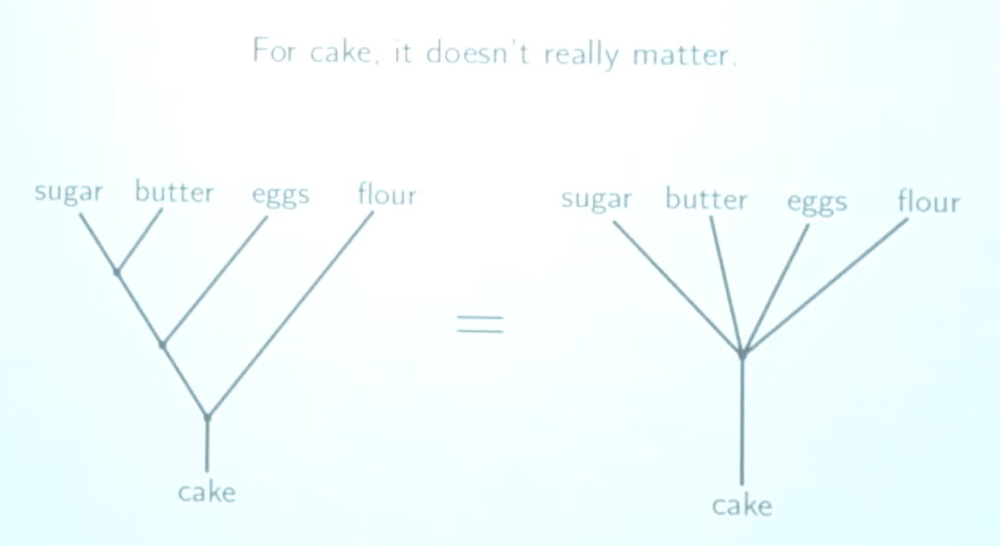

# Category theory and life

https://skillsmatter.com/skillscasts/10768-keynote-category-theory-in-life

- Maths is the logical study of how logical things work
- Move into abstract world where everything is abstract
- Abstract illuminates things.  It takes us further away, but now we can see further.
- London underground diagram showing logical relations (vs. geographical)
- A lens, a view, with certain strengths and weaknesses

## Objects and morphisms

- a view of certain relationships
- more structured that graph theory (and hence we can say more, more structured by composition)
- Composition is a generalisation of associativity / transitivity  (not commutativity).  It’s not the same as transitivity (e.g. 2 daughter morphisms don’t mean a third, but it does mean a 3rd of granddaughter)
- Composition means we can omit arrows that can be deduced

## Commutative square:

- Dan and Matt.  The ? is brother in law, are both circuits the same ?  We need to define sameness that we are looking for.


- Pages are 2d, lines of text are 1d in our 3d world, that blinds us to natural higher dimensional geometry



Shape is due to prime factors (2,3,5) and their products.  1 is a product of 0 factors.
Make it into sets of factors, then abstract that.



In this situation 6 is at a higher level than 7, even tho it is smaller.  This is showing different ordering, so ordering of how many elements make it up vs numeric size.



Can only compare down the lines.  Once we step off the lines, into sociology and politics, we are in the same principle as 6 above 7.  E.g. Rich white women are probably better off than poor white men.  Maybe that’s why they are agree, because they don’t feel they can compare to the other 2 at that level.

Redraw to better show ranking?


## Sameness

- All equations are lies.  e.g. 8 + 1 = 1 + 8.  The end result is the same, but process is different, and that is what makes it useful.
- CT wants different senses of sameness, which give us more structure.
- Numbers are boring, they are the same, or not


Custard vs Cake



It doesn’t matter if you have an electric whisk.  It does if you haven’t.
Context is key.

## Invertibility

- plus is very invertible.  Squaring less so because of negative answers.
- Isomorphic meaning invertible, the same in this context.  Means the two objects can be treated the same by the rest of the category.  Doesn’t mean they are the same or equal.  E.g. in Set, {1} and {2} are isomorphic.  Category can’t see the difference.
- Things can be isomorphic in one category, but not another.  This is not true of equality.
- CT is all about context.  Be explicit about the context, no absolute.
- Freezing: water->ice is invertible.  Eggs yolk not.  Milk sometimes.
- Whole categories can be isomorphic.

Equality of men and women.  Not about saying are they the same, more in which contexts should be treat them the same, and in which contexts should we not.

## Universal properties

- The role they play in a given context: The best, worst, biggest, smallest
- Initial object.  Morphisms come out of it, and a unique morphism so they are ‘pinned down’.  So in the lattices above, the top are initial.
- Choosing a different lattice gives a different initial.  People feel hard done by, by looking at the lattices they are far down in.

## Visual representation

- Abstract related to real world via geometry, make ‘abstract structures’
- Cliche like graph theory, everything in cliche is isomorphic to each other (and hence seen as the same by the category)

## It really isn’t that simple





The length and weight of arrows are *politics*, *judgement*.

* Everything should be understood in context
* Everyone is privileged in some contexts and not in others
* Everything should be studied in relationship with other things, not in isolation.  Systems thinking.
* Abstraction is pulling the torch further up.
* Abstraction can fit more stuff into a small place, packaging
* Ladder of abstractions
* Yoneda lemma.  Not enough to walk like a duck, and take like a duck, has to be regarded as a duck by other ducks.
