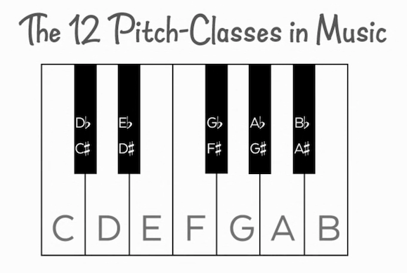
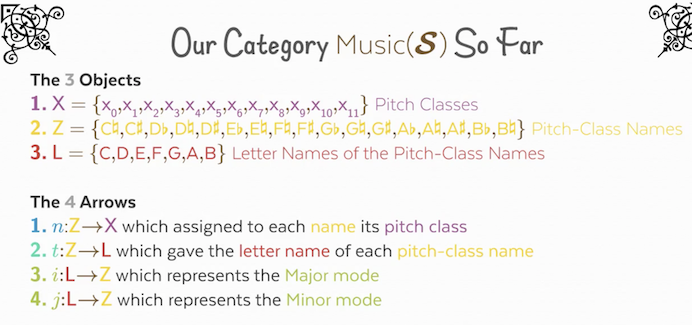
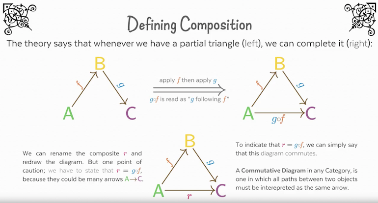
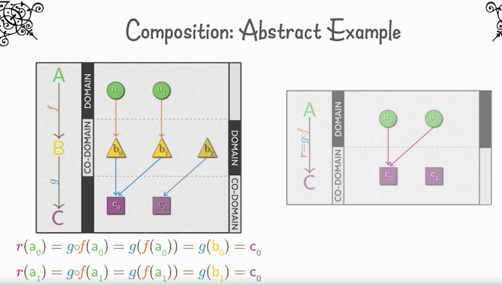
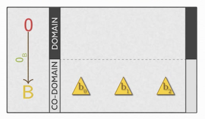
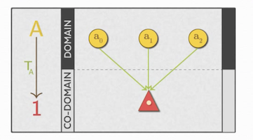
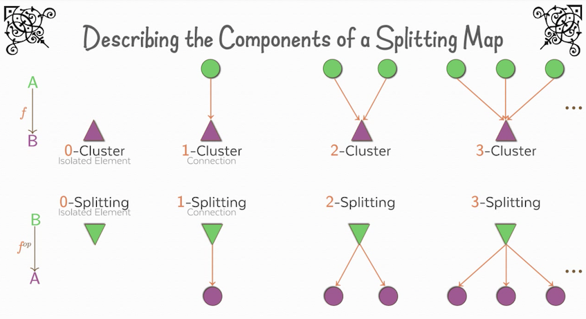
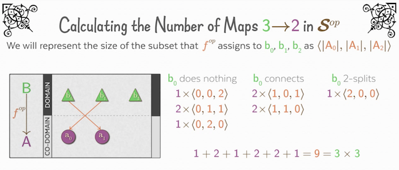

# Music stuff - CT The Beginner’s Introduction

[Source video](https://www.youtube.com/watch?v=P6DvIfTJhx8&app=desktop)

## Music intro

- 12 pitch classes (notes). Mode is a subset of these 12 e.g C major.
- Chromatic scale is all 12 notes.
- Major Cscale is: C, D, E, F, G, A, B
- Black notes have 2 names.  Sometimes have to use certain name.
- Minor C scale is: C, D, E♭, F, G, A♭, B
- | E.... B.... C♯m.... A.... :|

## CT intro

Definition of category:

- 3 Data: What the objects are, the arrows with their domain and co-domain (start and end object).  E.g. for S(Set), objects are abstract sets, arrows are functions, what identity is
- Rules: What the data must follow. 1 - Composition. 2 - Associtive. 3 - Identity composition

- To be a valid category, we must prove our objects and arrows follow these rules
- In S, an arrow must have a single co-domain for any given domain (but not visa-versa).

- Arrows are the core of CT, objects only exist to anchor the arrows.  Err on making more arrows rather than objects.
- Postive features of arrows, rather than what they are not.

## Category Music(S)

Abstract category S of Set, vs Music(S) which is actual notes in sets.

- Two objects, Pitch classes and Pitch-class names, each is a set.  Separate because the same class can have more than 1 name e.g. C#, Dflat
- Map name to class.  7 straight 1-to-1, 5 2-to-1.
Naming: 0-cluster, 1-cluster, etc.
- Add another Set of objects L, letter names of the pitch-class-names,
- Define the ‘maps’ on a single arrow.  Internal map vs External map

When composing a new arrow, be must list the composition, because there could be made arrows A->C

- After composition, clusters can stay same, or increase in size, never reduce
- Commuting diagram: all paths between 2 points are considered the same.
- number of maps from A -> B = Power law.  |b| ^ |a|

## Universal Mapping Properties (UWP).   

- Universal cones over diagrams.
- co-limit same as initial ?
- Swap definition to a the co

## Initial

- For Set, and O, there must be a unique map O -> X.  From power,  |X| ^ |O| = 1 for all x.  Because of this, |O| must be 0 for the maths to work, or empty set {}in
- Not all categories have them

## Terminal

Terminal:
- Reverse definition, giving us: For Set and T, for all objects X in the category, there is a unique arrow X -> T.  From power, |T| ^ |X| = 1 for all x, so T must be 1 !!!
- Not all categories have them



## Duality

- See F = A->B from different view
- Sometimes easier to reason in the dual category, so swap between the two

- Create opposite category, with mapping splitter rather than clustering.
- Permutations, 4 + 4 + 1.  So calculated in Sum and not Product !!

- Lesson 5: optimisation with domain and co-domain, of delivery and routes, etc.
- In S, choices are independent and order doesn’t matter.  
- In Sop (dual S), order matters and choices are not independent and decrease to zero as we go on!
- Terminal of Sop, is initial in S, and visa versa.
- Because there is opposite category, but that means all features of category have an co equivalent
- These splittings could be things like tasks and threadpools, or routes and packages, etc.
- Strategies like early assignment, late assignment, equal distribution

## Questions

- What are distributative categories ?