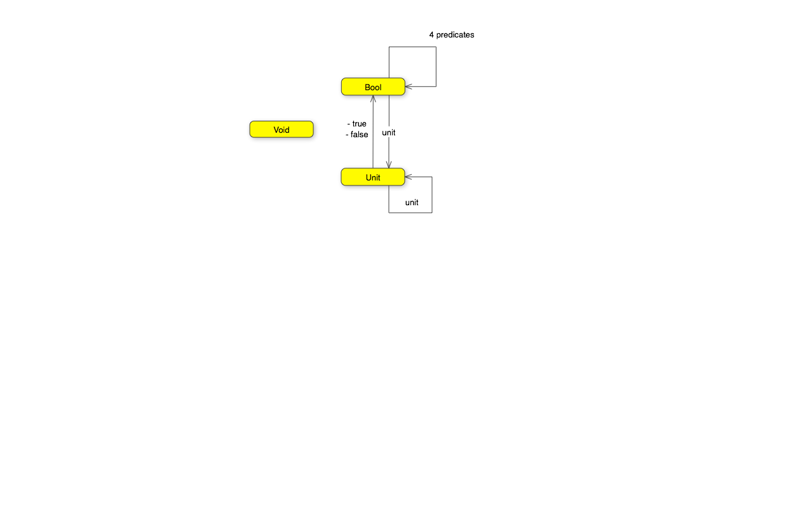

# 1. Category: The essense of composition

- A category is objects and arrows/morphisms.
- The arrows can be composed, and that is relationship is associative.
- Associative =  `a * (b * c) = (a * b) * c` 
- Each object had as identity arrow, that means unit in composition.
- Composition/Decomposition is necessary because we can’t deal with more than 7 +- 2 of things in our head at the same time.
- Surface area (external) should grow slower than volume (implementation).  We compose via the surface area.
- CT aims to reduce this surface area massively, to be nebulous concepts and arrows between them.

## Challenges

- “Implement, as best as you can, the identity function in your favorite language (or the second favorite, if your favorite language happens to be Haskell).

In C#: `public static T id<T>(T a) => a;`

- Implement the composition function in your favorite language. It takes two functions as arguments and returns a function that is their composition.

In C#: `public static Func<A,C> compose<A,B,C>(Func<A, B> f, Func<B,C> g ) => (x) => g(f(x));`

- Write a program that tries to test that your composition function respects identity.

```
            var trimUpper = compose((string a) => a.Trim(), (b) => b.ToUpper());
            var test = " aBC ";
            check("ABC", trimUpper(test));
            check("ABC", id(trimUpper)(test));
```

- Is the world-wide web a category in any sense? Are links morphisms?

Yes. Going to site A, following link f to Site B, and then following link g to Site C, is equivalent to the compoistion of both links in once, and going from A -> C.

- Is Facebook a category, with people as objects and friendships as morphisms?
When is a directed graph a category?” 

No facebook is not. If I'm friends with Alice, and Alice is friends with Bob, it doesn't mean I'm friends with Bob, friendships are not composable.  Plus you can't be friends with yourself.

A directed graph is only a category is it can have links to itself, and its links are composable.

# 2. Types

- Type is a set of values, finite or not
- Category of `Set`, morphisms are functions
- Hask is the same except for _|_ bottom means non termination. undefined in haskell.
- Denotaional semantics, encode programming so you can solve use maths equations
- CT Monads for computational side effects
- Void is the empty set, absurd, can't be called. Falsity in logic 
- Unit is the single value

## Challenges

- Memorise in F#

```
let memoize f =
    let mutable cache = Map.empty
    fun x ->
        match cache.TryFind x with
        | Some res -> res
        | None ->
             let res = f x
             cache = cache.Add(x,res)
             res
```

- Try to memoize a function from your standard library that you normally use to produce random numbers. Does it work?

No.

- Random number with seed. 

Yes

- “Which of these C++ functions are pure?”

Factorial: yes. getchar: no. f: no, side effect. f with static: no, hidden mutable.

- How many functions from Bool to Bool

```
let alwaysTrue  _   =  true
let alwaysFalse _   = false
let isTrue (x:bool) = x
let not             = function true -> false | false -> true
```

- Draw a picture of a category whose only objects are the types Void, () (unit), and Bool; with arrows corresponding to all possible functions between these types. Label the arrows with the names of the functions.

