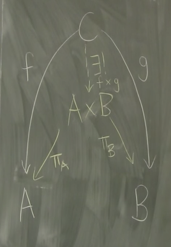

# CT - a framework for reasoning

[Source video](https://www.youtube.com/embed/ba_hon70qbg)

## Maths Terminology

- Groups: set of elements + operation with various rules. e.g. Integers with addition. Like semigroup with inverses as well.
- Ring: set with 2 operations that generalise addition and multiplication
- Module over a ring: generalisation of vector space over a field.
- Abelian group: Group which operations are communicative.  + and * are communicative, / and - are not.
- Field: any set with add/sub/mult/div which act in normal number way e.g. reals, rationals, complex numbers
- Vector space: vectors with + together, and can be * by scalars (any field)
- Kernel.  Values which when mapped, end up with the concept of zero.

Set terms:

- Injection: Each value in domain has 1 value in co-domain.  There may be other items in codomain.
- Surjection: Each value in co-domain has at least 1 value in domain.
- Bijection: 1 to 1 mapping completely (and hence invertible).  Combination of injective and surjective.

## Morphisms

Morphisms: preserve structure.  Can be complete invented, just a formal structure to work with.

- **Initial**: unique morphism from it to anything else
- **Terminal**: dual of initial
- **Mono** if for every morphism the result is the same (category theory version of injective)
- **Endo** CT vesion of surjective
- **Iso** if there exists a morphism in the reverse direction (implies bijection)

## Functors

- Functors are functions between categories.  
- A covariant functor: map each object and morphism into another category.  Has to respect the rules, so needs to map identity and composition.
- A contra-variant functor: goes the other way

Locally small: not infinite morphisms on any two objects.  
Hom functors: Category C -> Set. Push forward and pull back.  Map all objects + morphisms into their sets.

Can make a category from a monoid easily: one object, id, and morphisms which are multiple (or addition), I guess one for each fixed operand. Can then essentially copy this into Set as a single object.  Functor keeps composition in Set.

- Natural transformation.  Morphism on functors acting between 2 categories.
- Commuting diagram

## Product

Projection maps: can pull it apart.

Given sets A and B, and their cartesian product AxB, with maps to go back to A and B.  If we have a set C, with f and g functions, there must be a unique fxg=h which maps to AxB, making a communicative diagram.
e.g. h(c) = ( f(c), g(c) ).

A and B on a plane, everything else above.  Everything will factor down into AxB.  _Terminal cone_.

## Misc

Other terms I didn't fully understand include:

- Equalizers. Kernel is special case, zero map.
- Diagram of shape J in C, is a functor of J to C.
- Functor category.
- Adjunctions.
