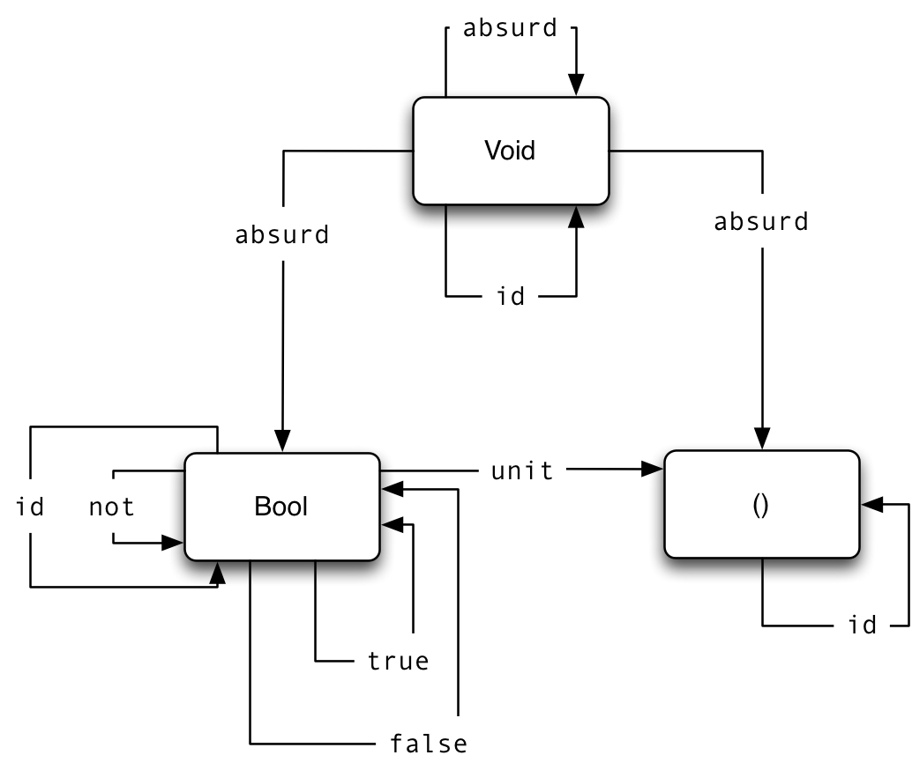

# [Chapter 2 - Types and Functions](https://bartoszmilewski.com/2014/11/24/types-and-functions)

## Notes

- Simple intuition for types is that they are sets of values (e.g. `Bool =
  {True, False}`).

- Technically, a type in Haskell is more than just the set of its possible
  values, because it also contains a special value '⊥' (or 'bottom') which
  corresponds to a non-terminating function.

- So, for example, a function `f :: Bool -> Bool` that doesn't terminate is
  considered to be a function that 'returns' ⊥.

- In Haskell, it's also possible to explicitly return bottom, e.g.:
    ```haskell
    f :: Bool -> Bool
    f = undefined
    ```

- As a result, the category of Haskell types and functions is often referred to
  as `Hask`, rather than `Set`.

- The type corresponding to an empty set is called `Void` in Haskell (although
  it's not the same as C++ / Java's `void`):
    - However, you can never call a function `f :: Void -> a` because to do so
      you would need to provide a value of type `Void`, of which there isn't
      one.
    - This is called `absurd :: Void -> a` in Haskell.
    - The logical interpretation (as per Curry-Howard) is 'ex falso quodlibet'
      ('from falsity follows anything')

- The type corresponding to a singleton set is a type that can only have one
  value - called 'unit':
    - `()` is used as the symbol for both the type and the value.
    - Every function `f :: () -> a` is equivalent to picking a fixed value of
      type `a`.

- The type corresponding to a two-element set is something like `data Bool =
  True | False`


## Challenges

1. _Define a higher-order function (or a function object) memoize in your
   favorite language. This function takes a pure function f as an argument and
   returns a function that behaves almost exactly like f, except that it only
   calls the original function once for every argument, stores the result
   internally, and subsequently returns this stored result every time it’s
   called with the same argument. You can tell the memoized function from the
   original by watching its performance. For instance, try to memoize a function
   that takes a long time to evaluate. You’ll have to wait for the result the
   first time you call it, but on subsequent calls, with the same argument, you
   should get the result immediately_

   See [02-types-and-functions-challenges.playground](02-types-and-functions-challenges.playground/Contents.swift)

2. _Try to memoize a function from your standard library that you normally use to
   produce random numbers. Does it work?_

   See [02-types-and-functions-challenges.playground](02-types-and-functions-challenges.playground/Contents.swift)

3. _Most random number generators can be initialized with a seed. Implement a
   function that takes a seed, calls the random number generator with that seed,
   and returns the result. Memoize that function. Does it work?_

   See [02-types-and-functions-challenges.playground](02-types-and-functions-challenges.playground/Contents.swift)

4. _Which of these C++ functions are pure? Try to memoize them and observe what
   happens when you call them multiple times: memoized and not.

    1. _The factorial function from the example in the text._ - Pure

    2. _The function_ `std::getchar()` - Impure

    3. _This function_:
        ```cpp
        f() {
          std::cout << "Hello!" << std::endl;
          return true;
        }
        ```

       Impure, because of the side-effect sending content to `std::cout`

    4. _This function_:
        ```cpp
        int f(int x) {
            static int y = 0;
            y += x;
            return y;
        }
        ```

        Impure, because the `y` is static

5. _How many different functions are there from Bool to Bool? Can you implement
   them all?_

   See [02-types-and-functions-challenges.playground](02-types-and-functions-challenges.playground/Contents.swift)

6. _Draw a picture of a category whose only objects are the types Void, ()
   (unit), and Bool; with arrows corresponding to all possible functions
   between these types. Label the arrows with the names of the functions._

   
   
   Discussion points (see [Challenges02.hs](Challenges02.hs)):
   
   * For `Void`, What does `id :: a -> a` mean and is it a distinct function from `absurd :: a -> a`?
   * Since `Hask` is a category, `Void` must have an identity morphism - is that `id` or is it `absurd`?
   * Is there such a function as `unit :: Void -> ()`
