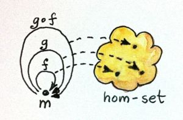
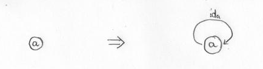
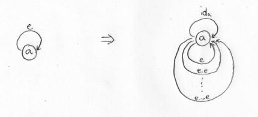
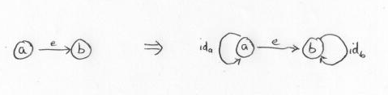
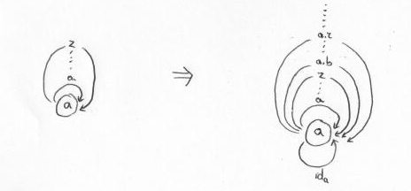

# [Chapter 3 - Categories Great and Small](https://bartoszmilewski.com/2014/12/05/categories-great-and-small/)

## Notes

### No Objects

- Trivial category is one with no objects or morphisms.

- Like an empty set, but for categories.

- Can be important in the context of other categories - e.g. the category of all
  categories.


### Simple Graphs

- Any directed graph can be turned into a _free category_ by:
    - Adding an identity arrow at each node
    - For any two _composable_ arrows, add a new arrow to serve as their
      composition
    - Repeat, adding new arrows as required


### Orders

- A binary relation `≤` on a set `P` is a _preorder_ if `≤` is both _reflexive_
  and _transitive_:
    - _Reflexive_ - `a ≤ a` for all `a` in `P`
    - _Transitive_ - if `a ≤ b` and `b ≤ c` then `a ≤ c` for all `a`, `b`, `c`
      in `P`.

- Equivalently, if the members of `P` are objects in a category `C` and there is a
  morphism between `a` and `b` iff `a ≤ b`, then the reflexivity and
  transitivity properties of `≤` are equivalent to the categorical properties of
  `C`.

- A preorder is a category where there is at most one morphism between any two
  objects `a` and `b` - this is called a _thin category_.

- If, in addition to being a _preorder_, `≤` is _anti-symmetric_ (i.e. `a ≤ b`
  and `b ≤ a` implies `a = b`) then `≤` is said to be a _partial order_.

- Finally, if any two distinct objects `a` and `b` are related by either `a ≤ b`
  or `b ≤ a`, then `≤` is said to be a _total order_.

- A set of morphisms from object `a` to object `b` in a category `C` is called a
  _hom-set_, denoted `C(a, b)` or <code>Hom<sub>C</sub>(a, b)</code>.


### Monoid as Set

- A _monoid_ is a set with a binary operation that is _associative_ and has an
  _identity_:
    - e.g. the set of integers under addition, with identity 0
    - or the set of all strings under concatenation, with identity `""`

- In Haskell, it's represented by the `Monoid` typeclass, although this can't
  represent the additional monoidal properties:
    ```haskell
    class Monoid m  where
        mempty  :: m
        mappend :: m -> m -> m

    instance Monoid String where
        mempty  = ""
        mappend = (++)
    ```


### Monoid as Category

- To move from set-based language to category-based language, think of the
  application of the binary operator as shifting elements around the set:
    - e.g. `(+ 5)` maps `0 -> 5`, `1 -> 6`, `2 -> 7` etc.
    - for any number `n` there is a function 'add n'
    - These compose easily - `(+ 5) . (+ 7) = (+ 12)`
    - The identity is just - `(+ 0)`

- Now, we can think of the set of integers as being a single object with a bunch
  of morphisms - one 'adder' for each member of the set:
    - So, a monoid is just a single-object category

- Conversely, given a categorical monoid `M` (a single object `a` with morphisms),
  then we have the _hom-set_ `M(m, m)` consisting of all the morphisms from `a`
  to `a`.

- `M(m, m)` is then a 'monoid-as-set':
    - <code>id<sub>m</sub></code> corresponds to `mempty`
    - `g . f` corresponds to `mappend f g`

        


## Challenges

1. _Generate a free category from:_

    1. _A graph with one node and no edges_

       This consists of just the single object `a` and the identity morphism
       <code>id<sub>a</sub></code>:

        

    2. _A graph with one node and one (directed) edge (hint: this edge can be
       composed with itself)_

       This consists of the single object `a`, its identity
       <code>id<sub>a</sub></code> and an infinite number of arrows from `a ->
       a`, corresponding to repeated applications of `e`:

        

    3. _A graph with two nodes and a single arrow between them_

       This consists of the two objects `a` and `b`, each object's identity, and the single
       arrow.  There are no more arrows like there were in (2), because the end
       of arrow `e` doesn't coincide with the start:

        

    4. _A graph with a single node and 26 arrows marked with the letters of the
       alphabet: a, b, c ... z._

       This consists of the single object `a`, its identity
       <code>id<sub>a</sub></code> and an infinite number of arrows,
       corresponding to the various combinations (of any length) of the arrows
       `a` to `z`:

        


2. _What kind of order is this?_

    1. _A set of sets with the inclusion relation: A is included in B if every
       element of A is also an element of B._

       A _partial order_.  It's not total, because the subset relation doesn't
       hold either way between the sets `{1, 2}` and `{3, 4}`

    2. _C++ types with the following subtyping relation: T1 is a subtype of T2
       if a pointer to T1 can be passed to a function that expects a pointer to
       T2 without triggering a compilation error._

       A _partial order_.  Again it's not total, because we could have two
       incompatible types that aren't related to each other.  On the other hand,
       I'm wondering whether something to do with the C++ type system means that
       we can have types `T1` and `T2` where `T1` is a subtype of `T2` and vice
       versa, but `T1` and `T2` aren't the same type?

3. _Considering that `Bool` is a set of two values `True` and `False`, show
   that it forms two (set-theoretical) monoids with respect to, respectively,
   operator `&&` (`AND`) and `||` (`OR`)._

    See [Challenges03.hs](Challenges03.hs)

4. _Represent the `Bool` monoid with the `AND` operator as a category: List the
   morphisms and their rules of composition._

    Objects     : A single object representing the set `{True, False}`
    Morphisms   : Two morphisms `(AND True)` (the identity) and `(&& False)`
    Composition :
        `(AND True)  . (AND True)  = (AND True)`
        `(AND True)  . (AND False) = (AND False)`
        `(AND False) . (AND True)  = (AND False)`
        `(AND False) . (AND False) = (AND False)`

5. _Represent addition modulo 3 as a monoid category._

    A single object - the set `{0, 1, 2}` with morphisms `(+ 0)` (= `id`), `(+
    1)` and `(+ 2)`.
