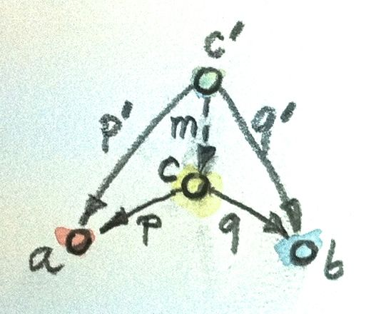

# [Chapter 5 - Products & Coproducts](https://bartoszmilewski.com/2015/01/07/products-and-coproducts)

## Notes

### Initial Object

- In a category, `a` is considered 'more initial' than `b` if there is a
  morphism from `a` to `b`, i.e. `∃ m ∈ Hom(a, b)`.

- The _initial object_ (if it exists) is the object that has *one and only one*
  morphism going to any object in the category.

- If it exists, the initial object is unique (up to isomorphism).

- Examples:
    - In a poset, the least element of the set (according to the poset's
      underlying order relation).
    - In `Set`, the initial object is `∅`, corrsponding to the Haskell type
      `Void`, because `absurb :: Void -> a` is the unique morphism from `Void`
      to any type `a`.


### Terminal Object

- Conversely to the discussion above, `a` is considered 'more terminal' than `b`
  if there is a morphism from `b` to `a`, ie. `∃ m ∈ Hom(b, a)`.

- The _terminal object_ (if it exists) is the object that has *one and only one*
  morphism coming from any object in the category.

- Like the initial object, if the terminal object exists, it is unique up to
  isomorphism.

- Examples:
    - In a poset, the greatest element of the set.
    - In `Set`, the terminal object is the singleton set, corresponding to the
      Haskell type `()`, because `unit :: a -> ()` is the unique morphism from
      any type `a` to `()`.


### Duality

- For any category `C`, the 'opposite category', <code>C<sup>op</sup></code> is
  the category formed by reversing the direction of all the morphisms in `C`.

- Composition in <code>C<sup>op</sup></code> is defined by:
    - If `f::a->b` and `g::b->c` compose to `h::a->c` with `h=g.f`
    - Then <code>f<sup>op</sup>::b->a</code> and
      <code>g<sup>op</sup>::c->b</code> will compose to
      <code>h<sup>op</sup>c->a</code> with
      <code>h<sup>op</sup>=f<sup>op</sup>.g<sup>op</sup></code>

- Reversing identity arrows is just a no-op.

- Constructions in <code>C<sup>op</sup></code> are prefixed with 'co' and are
  said to be the 'dual' of their constructions in `C`.

- The terminal object in `C` is the initial object in
  <code>C<sup>op</sup></code>.


### Isomorphism

- Objects `a` and `b` are said to be _isomorphic_ if there exist morphisms
  `f::a->b` and `g::b->a` such that <code>f.g = id<sub>b</sub></code> and
  <code>g.f = id<sub>a</sub></code>

- Proof that the intiial object is unique up to isomorphism:
    - Suppose there are two initial objects `i1` and `i2`
    - Since `i1` is initial, ∃ unique `f::i1->i2`
    - Since `i2` is initial, ∃ unique `g::i2->i1`
    - Composing these, `g.f :: i1 -> i1`
    - But, since `i1` is initial, there is only one morphism from `i1->i1`,
      namely <code>id<sub>i1</sub></code>
    - Therefore <code>g.f = id<sub>i1</sub></code>
    - A similar argument proves that <code>f.g = id<sub>i2</sub></code>
    - Therefore `i1` and `i2` are isomorphic

- The dual argument holds for terminal objects (see challenge 1 below).


### Products

- Consider the cartesian product of two sets `A`, `B`:
    ```
    A x B = { (a, b) | a ∈ A, b ∈ B }
    ```

- The two 'projection' functions `fst` and `snd` connect the product back to its
  constituents:
    ```haskell
    fst :: (a, b) -> a
    fst (x, _) = x

    snd :: (a, b) -> b
    snd (_, y) = y
    ```

- In general, in the category `Set`, we have a pattern that connects a product
  object `c` with its constituents `a` and `b` via two morphisms `p :: c -> a`
  and `q :: c -> b`:

    

- There are potentially lots of candidates for the product `c`, so how do we
  find the 'best' one?

    

- Consider two candidate products `c` and `c'` together with their projections
  `p :: c -> a`, `q :: c -> b` and `p' :: c' -> a`, `q' :: c' -> b`:

    

- `c` is considered to be 'a better product' if ∃ a morphism `m :: c' -> c` that
  _factorises_ `p'` and `q'`, i.e.:
    ```
    p' = p . m
    q' = q . m
    ```

- A _product_ of two objects `a` and `b` is the object `c` equipped with two
  projections `p :: c -> a` and `q :: c -> b` such that for *any* other object
  `c’` equipped with two projections `p' :: c' -> a` and `q' :: c' -> b` there
  is a unique morphism `m :: c' -> c` that factorizes `p'` and `q'`.


### Coproducts

- By reversing the arrows, we get the dual of the product, the _coproduct_

- We get an object `c`, equipped with two _injections_ `i :: a -> c` and `j ::
  b -> c` which get the component parts into the co-product:

    

- The ranking of candidate coproducts is also reversed - `c` (with injections
  `i`, `j`) is considered to be 'a better coproduct' than `c'` (with injections
  `i'`, `j'`) if ∃ a morphism `m :: c -> c'` that _factorises_ `i'` and `j'`,
  i.e.:
    ```
    i' = i . m
    j' = j . m
    ```

    

- So, a _coproduct_ of two objects `a` and `b` is the object `c` equipped with two
  injections `i :: a -> c` and `j :: b -> c` such that for *any* other object
  `c’` equipped with two injections `i' :: a -> c'` and `j' :: b -> c'` there
  is a unique morphism `m :: c -> c'` that factorizes `i'` and `j'`.

- e.g. for Sets, the coproduct corresponds to the disjoint union, and for
  `Hask` it corresponds to the `Either` type:
    ```
    data Either a b = Left a | Right b
    ```


## Challenges

1. _Show that the terminal object is unique up to unique isomorphism._

    Cheat mode: By duality.

    The full proof:
    - Suppose there are two terminal objects `t1` and `t2`
    - Since `t1` is terminal, ∃ unique `f::t2->t1`
    - Since `t2` is terminal, ∃ unique `g::t1->t2`
    - Composing these, `f.g :: t1 -> t1`
    - But, since `t1` is terminal, there is only one morphism from `t1->t1`,
      namely <code>id<sub>t1</sub></code>
    - Therefore <code>f.g = id<sub>t1</sub></code>
    - A similar argument proves that <code>g.f = id<sub>t2</sub></code>
    - Therefore `t1` and `t2` are isomorphic

2. _What is a product of two objects in a poset? Hint: Use the universal
   construction._

    The 'product' of two objects `a` and `b` is the 'largest' object that is
    'less than' both `a` and `b`, where 'largest' and 'less than' are defined
    by the poset's order relation `≤`:

      

    (finite) sets under ⊆ : `a x b = a ∩ b`  
    ℤ under ≤ : `a x b = min(a, b)`

3. _What is a coproduct of two objects in a poset?_

    The 'coproduct' of two objects `a` and `b` is the 'smallest' object that is
    not 'less than' both `a` and `b`, where 'smallest' and 'less than' are
    defined by the poset's order relation `≤`:

      

    (finite) sets under ⊆ : `a x b = a ∪ b`  
    ℤ under ≤ : `a x b = max(a, b)`


4. _Implement the equivalent of Haskell `Either` as a generic type in your
   favorite language (other than Haskell)._

    See [05-products-and-coproducts-challenges.playground](05-products-and-coproducts-challenges.playground/Contents.swift)

5. _Show that `Either` is a “better” coproduct than `int` equipped with two injections:_
    ```
    int i(int n) { return n; }
    int j(bool b) { return b? 0: 1; }
    ```

   _Hint: Define a function:_

   ```
   int m(Either const & e);
   ```

   _that factorizes i and j._

    See [Challenges05-5.hs](Challenges05-5.hs)

6. _Continuing the previous problem: How would you argue that `int` with the two
   injections `i` and `j` cannot be “better” than `Either`?_

    Proof by contradiction  

    Suppose `int` is 'better' than `Either`.  Then there would be a morphism
    `m` from `int` to `Either`  that factorises the two morphisms `i' :: Int ->
    Either Int Bool` and `j' :: Bool -> Either Int Bool`, where:

    ```
    i' :: Int -> Either Int Bool
    i' a = Left a

    j' :: Bool -> Either Int Bool
    j' b = Right b
    ```

      

    Since `m` factorises `i'`, `i' = m . i`.  Applying each side to `0`, we get
    `i'(0) = m(i(0))`.  Since `i(0) = 0` and `i'(0) = Left 0`, this reduces to
    `Left 0 = m(0)`.

    Applying similar logic to `j'`, `j' = m . j`, so applying each side to
    `True`, we get `j'(True) = m(j(True)) = m(0)`.  But `j'(True) = Right True`,
    so `Right True = m(0)`.

    We've derived two different values for `m(0)`.  This contradiction proves
    that we can't define the morphism `m` as required, so `int` cannot be
    'better' and `Either`.

7. _Still continuing: What about these injections?_

    ```
    int i(int n) {
      if (n < 0) return n;
      return n + 2;
    }

    int j(bool b) { return b? 0: 1; }
    ```

    See [Challenges05-7.hs](Challenges05-7.hs) for an implementation of a
    morphism that works.  Effectively, `int` with these revised injections is
    isomorphic to `Either`, because there's no overlap of '0' and '1' like there
    was in the original injections.

8. _Come up with an inferior candidate for a coproduct of `int` and `bool` that
   cannot be better than `Either` because it allows multiple acceptable
   morphisms from it to `Either`._


