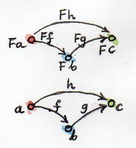
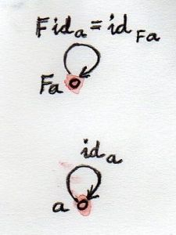

# [Chapter 7 - Functor](https://bartoszmilewski.com/2015/01/20/functors)

## Notes

- A _functor_ is a mapping between categories - given two categories `C` and `D`
  a functor `F` maps:
    - Objects in `C` to objects in `D`
    - Morphisms between objects in `C` to morphisms between objects in `D`

- Functors preserve connections, so if `f :: a -> b` is a morphism in `C`, then
  `F f :: F a -> F b` is the corresponding morphism in `D`.

  

- Also, if `h = g . f`, we want its image under `F` to be a composition of the
  images of `f` and `g` - i.e. `F h = F g . F f`

  

- Finally, identity morphisms in `C` are mapped to identity morphisms in `D` -
  i.e. <code>F id<sub>a</sub> = id<sub>F a</sub></code>:

  


## Functors in Programming

- In our category of types and functions, we can talk about functors that map
  this category to itself - these are called _endofunctors_

- For example, `Maybe` is a mapping from `a -> Maybe a`, where
    ```haskell
    data Maybe a = Nothing | Just a
    ```

- Given a function `f :: a -> b`, we can make the _lifted_ function `f' :: Maybe a
  -> Maybe b` as follows:
    ```haskell
    f' :: Maybe a -> Maybe b
    f' Nothing  = Nothing
    f' (Just x) = Just (f x)
    ```

- The transformation of `f` into `f'` is defined by a _higher-order function_
  `fmap :: (a -> b) -> (Maybe a -> Maybe b)`, defined as:
    ```haskell
    fmap :: a -> b -> Maybe a -> Maybe b
    fmap _ Nothing  = Nothing
    fmap f (Just x) = Just (f x)
    ```

- It's pretty straightforward to show that `fmap` satisfies the necessary laws
  to ensure that `Maybe` is a functor:
    ```haskell
    fmap id = id
    fmap (g.f) = fmap g . fmap f
    ```

- Haskell abstracts this into the `Functor` _typeclass_:
    ```haskell
    class Functor f where
        fmap :: (a -> b) -> f a -> f b

    -- This implements an instance of `Functor` for `Maybe`
    instance Functor Maybe wehere
        fmap _ Nothing  = Nothing
        fmap f (Just x) = Just (f x)
    ```


## The `List` Functor

- We can define the list datatype in Haskell as:
    ```haskell
    data List a = Nil | Cons a (List a)
    ```

- Then we can define that `List` is a `Functor` using the following recursive
  definition:
    ```haskell
    instance Functor List where
        fmap _ Nil        = Nil
        fmap f (Cons x t) = Cons (f x) (fmap f t)
    ```


## The `Reader` Functor

- `Functor` aren't just 'containers' like `Maybe` and `List`.  Consider the
  `Reader` functor `(->) r`, which represents a partially-applied function.

- To show that `(->) r` is a functor, we need to be able to take a function `f
  :: a -> b` and lift it into a function `(r -> a) -> (r -> b)`:
    ```haskell
    fmap :: (a -> b) -> (r -> a) -> (r -> b)
    -- Simple composition works just fine here!
    fmap f g = f . g
    ```


## `Functor` Composition

- Functors between categories compose in the obvious ways.

- It's particularly easy to compose _endofunctors_ because the source and
  destination categories are the same, e.g.:
    ```haskell
    maybeTail :: [a] -> Maybe [a]
    maybeTail []     = Nothing
    maybeTail (x:xs) = Just xs
    ```


## Challenges

1. _Can we turn the Maybe type constructor into a functor by defining:_

    ```haskell
    fmap _ _ = Nothing
    ```

   _which ignores both of its arguments? (Hint: Check the functor laws.)_

    This won't work.  If it were the case, then, by the first functor law `fmap
    id = id`.  Applying both sides of this equation to `Just 1` gives:
    ```haskell
    fmap id (Just 1) = id (Just 1)
    ```
    The RHS is `Just 1`, by definition of `id`.  According to our definition of
    `fmap` above, `fmap id (Just 1) = Nothing`.


2. _Prove functor laws for the reader functor. Hint: it’s really simple._

    - This follows trivially from the definition of `fmap` for `Reader` being
      just plain composition

    - _Functor identity law_ (`fmap id = id`):
        - Consider any function `g :: r -> a`
        - Then:
            ```haskell
            fmap id g = id . g           -- definition of fmap
                      = g                -- definition of . and id
            ```
        - Since `fmap id g = g` for all `g`, then `fmap id = id`

    - _Functor associativity law_ `fmap (f. g) = fmap f . fmap g`:
        - Consider any function `h :: r -> a`
        - Then:
            ```haskel
            fmap (f . g) h = (f . g) h              -- definition of fmap
                           = f . (g . h)            -- associativity of .
                           = f . (fmap g h)         -- definition of fmap
                           = fmap f (fmap g h)      -- definition of fmap
                           = (fmap f) . (fmap g) h  -- definition of .
            ```
        - Since `fmap (f . g) h = (fmap f) . (fmap g) h` for all `h`, then `fmap
          (f . g) = fmap f . fmap g`


3. _Implement the reader functor in your second favorite language (the first
   being Haskell, of course)._

   See [07-functors-challenges.playground](07-functors-challenges.playground/Contents.swift)

4. _Prove the functor laws for the list functor. Assume that the laws are true
   for the tail part of the list you’re applying it to (in other words, use
   induction)._

    - Proof of `fmap id = id` by equational reasoning:
        ```haskell
        fmap id Nil = Nil
                    = id Nil

        fmap id (Cons x t) = Cons (id x) (fmap id t)
                           = Cons x (fmap id t)
                           = Cons x (id t)
                           = Cons x t
        ```

    - Proof of `fmap (f . g) = fmap f . fmap g` by equational reasoning:
        ```haskell
        fmap (f . g) Nil = Nil
                         = id Nil
                         = fmap f Nil
                         = fmap f (id Nil)
                         = fmap f (fmap g Nil)
                         = (fmap f) . (fmap g) Nil

        fmap (f . g) (Cons x t) = Cons ((f . g) x) (fmap (f . g) t)
                                = Cons ((f . g) x) ((fmap f) . (fmap g) t)
                                = Cons (f (g x))   (fmap f (fmap g t)))
                                = fmap f (Cons (g x) (fmap g t))
                                = fmap f (fmap g (Cons x t))
                                = ((fmap f) . (fmap g)) (Cons x t)
        ```

