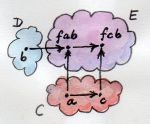

# [Chapter 8 - Functoriality](https://bartoszmilewski.com/2015/02/03/functoriality)

## Notes

### Bifunctors

- A _bifunctor_ is a functor of two arguments, which maps every pair of objects,
  one each from categories `C` and `D` to an object in category `E`:

  

- This is just like saying it's a mapping from the cartesian product `C x D` to
  `E`.

- It must also map a pair of morphisms, one from `C` and one from `D` to a
  morphism in `E`.

- A pair of morphisms is just a single morphism in `C x D`, with identity `(id,
  id)` and composition defined as: 

    ```
    (f, g) . (f', g') = (f . f', g . g')
    ```

- Bifunctors can also be thought of as functors in both arguments, so we can
  check functor laws separately for each argument.

- Bifunctors in Haskell are defined by the `Bifunctor` typeclass:
    ```haskell
    class Bifunctor f where
        bimap :: (a -> c) -> (b -> d) -> f a b -> f c d
        bimap g h = first g . second h

        first :: (a -> c) -> f a b -> f c b
        first g = bimap g id

        second :: (b -> d) -> f a b -> f a d
        second = bimap id
    ```

  

  

  


### Product and Coproduct Bifunctors

- If the product exists for a pair of objects, the mapping from those objects to
  the product is bifunctorial.  For example, in Haskell consider the `(,)`
  operator, which is the pair constructor:
    ```haskell
    instance Bifunctor (,) where
        bimap f g (x, y) = (f x, g y)
    ```

- By duality the same works for a co-product, e.g.:
    ```haskell
    instance Bifunctor Either where
        bimap f _ (Left  x) = Left  (f x)
        bimap _ g (Right y) = Right (g y)
    ```

- 


## Challenges

1. _Show that the data type:_

    ```haskell
    data Pair a b = Pair a b
    ```

   _is a bifunctor._

    From the text, it suffices to prove that `Pair` is functorial in each of its
    arguments (keeping the other one constant).

    Consider the second argument first - we can write the following instance of
    `Functor` for `Pair a`:

    ```haskell
    instance Functor (Pair a) where
        fmap f (Pair x y) = Pair x (f y)
    ```

    Then, we'll show that the functor laws are valid:

    ```haskell
    fmap id (Pair x y) = Pair x (id y)
                       = Pair x y
    => fmap id = id

    fmap (f . g) (Pair x y) = Pair x ((f . g) y)
                            = Pair x (f (g (y))
                            = fmap f (Pair x (g y))
                            = fmap f (fmap g (Pair x y))
                            = (fmap f) . (fmap g) (Pair x y)
    => fmap (f . g) = (fmap f) . (fmap g)
    ```

    A similar argument applies to keeping the second argument constant, but I'm
    not sure I can write it all out in Haskell, because I can't write `instance
    Functor (Pair _ b)`.

   _For additional credit implement all three methods of Bifunctor..._

    ```haskell
    instance Bifunctor Pair where
        bimap g h (Pair a b) = Pair (g a) (h b)
        first g (Pair a b) = Pair (g a) b
        second h (Pair a b) = Pair a (h b)
    ```

   _... and use equational reasoning to show that these definitions are
   compatible with the default implementations whenever they can be applied._

    I think think means showing that if we take our definition of `bimap` and
    plug it into the default for `first` and `second` we get back the same as
    our definitions of those methods:

    ```haskell
    -- Given our definition of `bimap`:

    bimap g h (Pair a b) = Pair (g a) (h b)

    -- Default implementation of `first` and `second`

    first g (Pair a b) = bimap g id (Pair a b)
                       = Pair (g a) (id b)
                       = Pair (g a) b
                       -- ...which is our definition of `first`

    second h (Pair a b) = bimap id h (Pair a b)
                        = Pair (id a) (h b)
                        = Pair a (h b)
                        -- ...which is our definition of `second`
    ```

    ...and vice versa:

    ```haskell
    -- Given our definitions of `first` and `second`:

    first  g (Pair a b) = Pair (g a) b
    second h (Pair a b) = Pair a (h b)

    -- Default implementation of `bimap`:

    bimap g h (Pair a b) = (first g . second h) (Pair a b)
                         = first g (second h (Pair a b))
                         = first g (Pair a (h b))
                         = Pair (g a) (h b)
                         -- which is our definition of `bimap`
    ```


2. _Show the isomorphism between the standard definition of `Maybe` and this
   desugaring:_

    ```haskell
    type Maybe' a = Either (Const () a) (Identity a)
    ```

   _Hint: Define two mappings between the two implementations. For additional
   credit, show that they are the inverse of each other using equational
   reasoning._


3. _Let’s try another data structure. I call it a `PreList` because it’s a
   precursor to a `List`.  It replaces recursion with a type parameter `b`:_

    ```haskell
    data PreList a b = Nil | Cons a b
    ```

   _You could recover our earlier definition of a `List` by recursively applying
   `PreList` to itself (we’ll see how it’s done when we talk about fixed
   points)._

   _Show that `PreList` is an instance of `Bifunctor`._


4. _Show that the following data types define bifunctors in `a` and `b`:_

    ```haskell
    data K2 c a b = K2 c
    data Fst a b = Fst a
    data Snd a b = Snd b
    ```

   _For additional credit, check your solutions agains Conor McBride’s paper
   [Clowns to the Left of me, Jokers to the
   Right](http://strictlypositive.org/CJ.pdf)_.


5. _Define a bifunctor in a language other than Haskell. Implement bimap for a
   generic pair in that language._


6. _Should `std::map` be considered a bifunctor or a profunctor in the two
   template arguments `Key` and `T`? How would you redesign this data type to
   make it so?_

