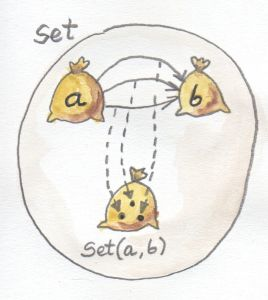
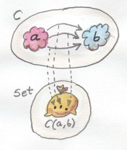
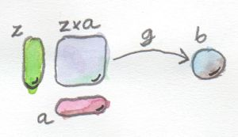
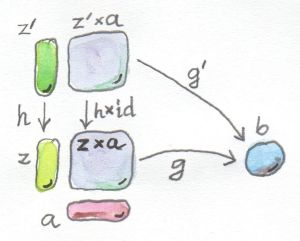
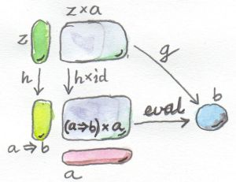

# [Chapter 9 - Function Types](https://bartoszmilewski.com/2015/03/13/function-types)

## Notes

- A function type `a -> b` is a set of morphisms between objects `a` and `b` -
  also known as a _hom-set_.

- In the category `Set`, every hom-set is itself an object, because it's a set:

  

- In categories other than `Set`, hom-sets are _external_ to a category:

  


### Universal Construction

- A function type can be considered a 'composite' type because it has a
  relationship to the argument and result types.

- When trying to construct a general definition of a function type in a
  category, we'll use a similar approach to that used for product types and
  coproduct types.

- The obvious pattern to connect a function type with its argument and result
  types is _function application_ or _evaluation_:
    - Given a candidate `z` for a function type and the argument type `a`, the
      application maps this pair to the result type `b`.

- If we could look inside objects, we could pair a function `f` in `z` with an
  argument `x` in `a` and map it to `f x` in `b`.

- Instead of dealing with individual objects, consider the whole _product_ of
  the function type with the argument type - i.e. `z x a`, then we can pick a
  morphism that connects `z x a` to `b`

  

- If the category doesn't have a product type defined for it, it also doesn't
  have a function type.

- As with construction of the product type, this pattern potentially gives us
  lots of potential hits, so we need to define ranking in order to find the
  'best' pattern.

- To do this, we require that there is a unique mapping between two 'candidate'
  objects `z` and `z'` that 'factorises' our construction.

- `z` together with `g :: z x a -> b` is _better_ than `z'` with `g' :: z' x a
  -> b` iff there is a unique `h :: z' -> z` such that the application of `g'`
  factors through the application of `g` - i.e. `g' = g . (h x id)`

  

- Finally, we need to select the object that is universally the best.  We'll
  call this `a=>b`, together with its own application `eval :: (a=>b)xa -> b`.
  This is the 'best' if any other candidate for a function object can be
  uniquely mapped to it in such a way that its application morphism `g`
  factorises through `eval`:

  

- The formal definition is thus:

  A function object from `a` to `b` is an object `a=>b` together with the
  morphism:
  ```
  eval :: ((a=>b) × a) -> b
  ```
  such that for any other object `z` with a morphism `g :: z × a -> b` there is
  a unique morphism
  ```
  h :: z -> (a=>b)
  ```
  that factors `g` through `eval`:
  ```
  g = eval ◦ (h × id)
  ```


### Currying

### Exponentials

### Cartesian Closed Categories

### Exponentials & Algebraic Data Types

### Curry-Howard Isomorphism


