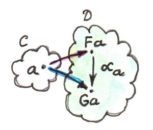
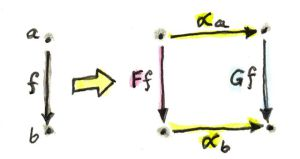

# [Chapter 10 - Natural Transformations](https://bartoszmilewski.com/2015/04/07/natural-transformations)

## Notes

### Definition

- _Natural transformations_ are mappings between functors that preserve their
  functorial nature.

- Consider two functors `F` and `G` between categories `C` and `D`, that map `a`
  to `F a` and `G a` respectively.  Then a natural transformation `α` picks one
  morphism from `F a` to `G a`, called the _component of `α` at `a`_, or
  <code>α<sub>a</sub></code>:

  

- The natural transformation `α` must be able to pick such a morphism for every
  `a` in `C`.  If for some `a` there is no such morphism between `F a` and `G
  a`, then there can be no natural transformation between `F` and `G`.

- Now consider a morphism `f :: a -> b` between two objects in `C`.  Under any
  natural transformation between `F` and `G`, `F f` must be transformed into `G
  f`.  So we have the following:

    ```
    F f :: F a -> F b
    G f :: G a -> G b

    αa :: F a -> G a
    αb :: F b -> G b
    ```

- These relationships are shown in the following diagram:

  

- There are now two ways to get from `F a` to `G b`, which must commute, which
  implies the following _naturality condition_:

  <code>G f ∘ α<sub>a</sub> = α<sub>b</sub> ∘ F f</code>

- Natural transformations map morphisms in `C` to commuting naturality squares
  in `D`:

  


### Polymorphic Functions

- In programming, functors correspond to type constructors that map types to
  types, and functions to functions.

- To construct a natural transformation, we start with a type `a`.  One functor
  maps `a -> F a` and another maps `a -> G a`.  Then the component of `alpha` at
  `a` is a function from `F a` to `G a` - i.e. `alpha-a :: F a -> G a`.

- A natural transformation is therefore a function `alpha` that is defined
  polymorphically for all types `a` - `alpha :: F a -> G a`.

- As it turns out in Haskell, any such polymorphic function `alpha`
  automatically satisfies the naturality condition.  Written in pseudo-Haskell,
  this means:

    ```haskell
    fmap f . alpha = alpha . fmap f
    ```

- One way of thinking about functors in Haskell is as 'generalised containers'.
  In this context, natural transformations can be thought of as ways of
  repackaging one container into another container.  We don't modify the items
  or create new ones, just change their 'packaging'.

- The naturality condition then says that it doesn't matter whether we modify
  the items first (via `fmap`) then repackage, or vice versa.

- Example of transformaiton between `[]` and `Maybe` functors:

    ```haskell
    safeHead :: [a] -> Maybe a
    safeHead []     = Nothing
    safeHead [x:xs] = Just x
    ```

- Since this is polymorphic in `a`, it's a natural transformation, but we can
  verify the naturality condition via equational reasoning:

    ```haskell
    -- Empty list case
    fmap f (safeHead []) = fmap f Nothing = Nothing
    safeHead (fmap f []) = safeHead []    = Nothing

    -- Non-empty list case
    fmap f (safeHead (x:xs)) = fmap f (Just x)            = Just (f x)
    safeHead (fmap f (x:xs)) = safeHead (f x : fmap f xs) = Just (f x)
    ```

- Consider the `Reader` functor again, written as a `newtype`:

    ```haskell
    newtype Reader e a = Reader (e -> a)

    instance functor (Reader e) where
        fmap f (Reader g) = Reader (\x -> f (g x))
    ```

- Set `e` to be the unit type `()` - then we have a functor `Reader ()` which
  takes any type `a` and maps it into a function type `() -> a`.

- Now consider natural transformations from `Reader ()` to `Maybe`:

    ```haskell
    alpha :: Reader () a -> Maybe a

    -- There are just two such transformations

    dumb (Reader _)    = Nothing

    obvious (Reader g) = Just (g ())
    ```


## Challenges

1. _Define a natural transformation from the `Maybe` functor to the list functor._

    ```haskell
    maybeToList :: Maybe a -> [a]
    maybeToList Nothing  = []
    maybeToList (Just x) = [x]
    ```

   _Prove the naturality condition for it._

    We need to prove that `fmap f . maybeToList = maybeToList . fmap f`.

    ```haskell
    -- Case 1: Nothing:
    fmap f . maybeToList $ Nothing = fmap f (maybeToList Nothing)
                                   = fmap f []
                                   = []

    maybeToList . fmap f $ Nothing = maybeToList (fmap f Nothing)
                                   = maybeToList Nothing
                                   = []

    -- Case 2: Just x:
    fmap f . maybeToList $ (Just x) = fmap f (maybeToList (Just x))
                                    = fmap f [x]
                                    = [f x]

    maybeToList . fmap f $ (Just x) = maybeToList (fmap f (Just x))
                                    = maybeToList (Just (f x))
                                    = [f x]
    ```

2. _Define at least two different natural transformations between `Reader ()`
   and the list functor._

    The two options either always produce an empty list, or produce a singleton
    list consisting of the single application of `g` to `()`.  There are an
    infinite number of possible natural transformations, according to how many
    copies of `g ()` are put in the destination list:

    ```haskell
    empty :: Reader () a -> [a]
    empty (Reader _) = []

    singleton :: Reader () a -> [a]
    singleton (Reader g) = [g ()]

    double :: Reader () a -> [a]
    double (Reader g) = [g (), g ()]
    ```

    _How many different lists of `()` are there?_

    Infinitely many, depending on how many copies of `()` are in the list - i.e.
    `[]`, `[()]`, `[(), ()]`, `[(), (), ()]` and so on.  These are in 1-1
    correspondence with the natural transformations defined above.

3. _Continue the previous exercise with `Reader Bool` and `Maybe`._

    We can either always return `Nothing`, or return a `Just` that contains the
    results of applying the `Reader` to `False` or `True`:

    ```haskell
    alwaysNothing :: Reader Bool a -> Maybe a
    alwaysNothing (Reader _) = Nothing

    applyFalse :: Reader Bool a -> Maybe a
    applyFalse (Reader g) = Just $ g False

    applyTrue :: Reader Bool a -> Maybe a
    applyTrue (Reader g) = Just $ g True
    ```

    These three natural transformations are in 1-1 correspondence with the three
    possible members of `Maybe Bool` - namely, `Nothing`, `Just False` and `Just
    True`.
